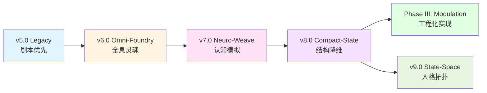

# Phase II: Resonance (共鸣)

> **基于长文本语境下的 AI 角色人格锚定与叙事动力学构建**
> *AI Persona Anchoring and Narrative Dynamics in Long-Context Environments*

## 🌓 项目概述 (Overview)

**Phase II: Resonance** 标志着研究重心从"对抗遗忘"（Phase I）转移至"灵魂构建"。

在这一阶段，我们不再满足于利用 RAG 补丁来维持角色记忆，而是利用 G3.0 模型的超长上下文窗口，构建了一套**"ETL-XML-Axiom"三位一体架构**。我们证明了：通过结构化的认知容器与元认知指令，可以从根本上解决 AI 角色的"扁平化"与"叙事死锁"问题。

本目录归档了该阶段产出的核心协议与工具链。

当前在 `v8.0 Compact-State` 主线之外，还补充了一组面向**单一 System Prompt 聊天宿主**的 Lite 生产层协议，用于角色主提示词的轻量锻造。`v9.0 State-Space` 在 Compact-State 基础上引入了**人格拓扑**：对不变身份锚点、张力可变行为包络与边界条件的显式建模。

## 📜 核心报告 (Core Report)

*   **["共鸣"项目研究报告-Repo-Git.pdf](./“共鸣”项目研究报告-Repo-Git.pdf)**
    *   详细阐述了 XML 协议的设计哲学、叙事公理体系（如"心理流动性"）以及 ETL 分步铸造的理论基础。

## 🚦 版本演进说明 (Version History)

> **关于 v1.0 - v4.x 版本：**
> 由于早期版本处于高度实验性阶段（Ad-hoc Scripts），且缺乏系统的版本控制，相关资产已归档或废弃。v5.0 是首个达到工业级稳定性并被社区广泛采用的里程碑版本。

本仓库收录了五个关键版本，它们代表了不同的工程取向与理论演进：

| 版本 | 代号 | 定位 | 特点 | 适用场景 |
| :--- | :--- | :--- | :--- | :--- |
| **v5.0** | **Legacy** | 标准版 | **剧本优先 (Scenario-First)**。 结构紧凑，易于上手，产出稳定。 | 快速创作、标准角色卡制作、社区分享。 |
| **v6.0** | **Omni-Foundry** | 全能铸造厂 | **全息灵魂 (Holographic Soul)**。 引入动态状态机、逻辑门与 L-System 分级。 | 深度心理博弈、动态视觉小说开发、技术原型。 |
| **v7.0** | **Neuro-Weave** | 神经编织引擎 | **认知模拟 (Cognitive Simulation)**。 Bio-XML 理念、过程导向、三大认知公理。 | 心理真实感、可攻略性、工程化实现。 |
| **v8.0** | **Compact-State** | 紧凑态更新 | **结构降维 (Structural Compaction)**。 以 YAML+Markdown 轻骨架压缩格式性文本开销，保护正文空间与注意力密度。 | 工业化生产、上下文节流、轻结构运行。 |
| **v9.0** | **State-Space** | 状态空间引擎 | **人格拓扑 (Persona Topology)**。 在 Compact-State 基础上显式建模不变轴、可变轴与边界条件，实现拓扑感知的状态导航。 | 高保真角色模拟、边界条件管理、ETL 变换流水线。 |

### 版本对比矩阵

| 维度 | v5.0 Legacy | v6.0 Omni-Foundry | v7.0 Neuro-Weave | v8.0 Compact-State | v9.0 State-Space |
|:---|:---|:---|:---|:---|:---|
| **设计哲学** | 剧本优先 | 全息灵魂 | 认知模拟 | 紧凑态认知 | 人格拓扑 |
| **引擎命名** | FurryBar Engine | FurryBar Engine | FurryBar Neuro-Weave Engine | FurryBar Engine | FurryBar Engine |
| **主题更新** | Legacy | Omni-Foundry | Neuro-Weave | Compact-State | State-Space |
| **数据格式** | XML | XML | Bio-XML | YAML + Markdown | YAML + Markdown |
| **核心机制** | 5-Phase ETL | 动态状态机 + 逻辑门 | Bio-XML + 认知公理 | Compact-State + 最小骨架 | 人格拓扑 + 状态导航器 |
| **格式开销** | 中 | 高 | 很高 | 低 | 低 |
| **注意力污染** | 中 | 高 | 中 | 低 | 低 |
| **复杂度** | ⭐⭐ | ⭐⭐⭐⭐⭐ | ⭐⭐⭐⭐⭐ | ⭐⭐⭐⭐ | ⭐⭐⭐⭐ |
| **工程化** | 手动操作 | 手动操作 | 自动化工具链（Prism-ETL） | 自动化工具链（计划中） | 自动化工具链（计划中） |

## 📂 目录导航 (Navigation)

*   **[`v5_Legacy/`](./v5_Legacy/)**: 包含 v5.0 版本的 ETL 提示词与格式规范。这是目前门槛最低、兼容性最好的版本。
*   **[`v6_Omni_Foundry/`](./v6_Omni_Foundry/)**: 包含 v6.0 版本的完整内核与驱动模块。虽然操作复杂度较高，但其产出的角色具有无与伦比的逻辑深度与动态交互能力。
*   **[`v7_Neuro_Weave/`](./v7_Neuro_Weave/)**: 包含 v7.0 版本的神经编织引擎。基于 Bio-XML 理念和认知公理，实现了从"结构化数据容器"到"活体认知系统"的范式转变。
*   **[`v8_Compact-State/`](./v8_Compact-State/)**: 包含 v8.0 的 Compact-State 主题更新。通过 YAML+Markdown 轻骨架压缩格式性文本开销，减少对正文空间与注意力的挤占。
*   **[`v8_Compact-State_Lite/`](./v8_Compact-State_Lite/)**: 包含 v8.0 的 Lite 生产层协议。面向 Chatbox、QuickQuip 一类单一 System Prompt 宿主，聚焦角色主提示词锻造。
*   **[`v9_State-Space/`](./v9_State-Space/)**: 包含 v9.0 的 State-Space 人格拓扑引擎。在 Compact-State 基础上引入显式人格拓扑建模，支持拓扑感知的状态导航与 ETL 变换流水线。⭐ 最新

## 🔄 演进路径 (Evolution Path)

### 关键里程碑

- **v5.0 (2025 Q2)**：确立 ETL-XML-Axiom 三位一体架构，首次实现工业级稳定性
- **v6.0 (2025 Q3)**：引入动态状态机和逻辑门，达到技术复杂度巅峰
- **v7.0 (2026 Q1)**：简化复杂度，强化心理真实感，为工程化实现奠定基础
- **Phase III (2026 Q1)**：基于 v7.0 理论，开发 Prism-ETL 自动化工具链
- **v8.0 (2026 Q1)**：以 Compact-State 为主题更新，将协议从重结构包装转向轻骨架表达，压缩格式负担并保护正文带宽
- **v9.0 (2026 Q2)**：引入人格拓扑（Persona Topology），显式建模不变轴、可变轴与边界条件，实现拓扑感知的状态导航与 ETL 变换流水线

## 🎯 选择指南 (Selection Guide)

### 我应该使用哪个版本？

- **如果你是新手**：从 [`v5_Legacy`](./v5_Legacy/) 开始，它提供了最平滑的学习曲线
- **如果你需要深度博弈**：使用 [`v6_Omni_Foundry`](./v6_Omni_Foundry/)，但需要投入时间学习其复杂的逻辑系统
- **如果你追求心理真实感**：使用 [`v7_Neuro_Weave`](./v7_Neuro_Weave/)，它在复杂度和效果之间取得了最佳平衡
- **如果你需要轻结构的工业化协议**：使用 [`v8_Compact-State`](./v8_Compact-State/)，它通过 Compact-State 更新显著降低了格式负担与注意力污染
- **如果你需要单一 System Prompt 角色主提示词**：使用 [`v8_Compact-State_Lite`](./v8_Compact-State_Lite/)，它聚焦聊天宿主中的人格压缩与可部署性
- **如果你需要拓扑感知的高保真角色模拟**：使用 [`v9_State-Space`](./v9_State-Space/)，它在 Compact-State 基础上引入人格拓扑建模与 ETL 变换流水线 ⭐
- **如果你需要自动化工具**：直接使用 [Phase III: Modulation](../03_Modulation/) 中的 Prism-ETL 工具链

## 🔗 相关资源 (Related Resources)

- **Phase I: Echo** - RAG 增强记忆系统 → [查看](../01_Echo/)
- **Phase III: Modulation** - 基于 v7.0 的工程化实现 → [查看](../03_Modulation/)
- **研究报告** - 理论基础与实验数据 → [PDF](./“共鸣”项目研究报告-Repo-Git.pdf)

---
*Return to [Root Repository](../README.md)*
