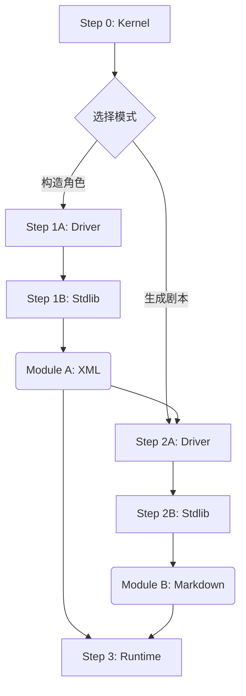

# Protocol v6.0: Omni-Foundry (Holographic Soul)

> **基于动态状态机与 L-System 的下一代角色引擎**
> *Next-Gen Character Engine based on Dynamic State Machines & L-System*

## ⚠️ 前置说明 (Pre-requisites)

**v6.0 Omni-Foundry** 代表了 "Resonance" 阶段的技术巅峰。与 v5.0 相比，它引入了编程语言级别的逻辑控制（Logic Gates）和数学化的状态追踪。

*   **复杂度警告**：v6.0 采用了完全解耦的模块化设计，手动操作流程较为繁琐。
*   **技术原型**：本协议是 Phase III (Modulation) 中自动化工具链 `Prism-ETL` 的底层逻辑基础。

## 🧬 核心特性 (Core Features)

1.  **全息灵魂 (Holographic Soul)**：引入 `<cognitive_core>` (MBTI/Alignment) 和 `<psycho_texture>`，实现人格的深层锚定。
2.  **动态状态机 (Dynamic State Machine)**：通过 `<psycho_dynamics>` 定义 X/Y 轴变量，并利用 `<logic_gates>` 实现行为模式的实时切换。
3.  **语言指纹 (Linguistic Fingerprint)**：量化角色的句法节奏、词库禁忌与修辞偏好，彻底消除“AI 翻译腔”。
4.  **L-System 叙事分级**：基于 L1-L5 的标准化内容分级与剧本生成系统。

## 🔧 模块详解 (Module Breakdown)

v6.0 的执行流程严格遵循 **Kernel -> Driver -> Stdlib** 的计算机科学范式：

### 0. 内核层
*   **[`Step0-Kernel.md`](./Step0-Kernel.md)**: **Hypervisor**。负责初始化环境，并在 "Architect Mode" (构造) 与 "Director Mode" (导演) 之间切换。

### 1. 构造层 (Module A: Character)
*   **[`Step1A-MainDriver.md`](./Step1A-MainDriver.md)**: **角色架构师驱动**。定义了从 Phase 0 到 Phase 4 的角色铸造流水线。
*   **[`Step1B-MainStdlib.md`](./Step1B-MainStdlib.md)**: **标准库**。定义了 v6.0 极其复杂的 XML Schema（包含逻辑门、MBTI 等接口）。

### 2. 导演层 (Module B: Scenario)
*   **[`Step2A-StoryDriver.md`](./Step2A-StoryDriver.md)**: **剧本导演驱动**。负责 L-System 分级判定与剧情构思 (Brainstorming)。
*   **[`Step2B-StoryStdlib.md`](./Step2B-StoryStdlib.md)**: **剧本标准库**。定义了 "UI/Logic 分离" 的剧本输出格式（Metadata + Intro + XML Payload）。

### 3. 运行层 (Runtime)
*   **[`Step3-Runtime.md`](./Step3-Runtime.md)**: **全息思维链引擎**。
    *   强制 LLM 进行数学运算（State Calculation）。
    *   实时校准语言指纹。
    *   动态渲染 HUD（状态面板）。

## ⚙️ 执行流水线 (Execution Pipeline)

为了获得最佳效果，请严格按照以下顺序操作：

1.  加载 `Step0` 初始化。
2.  注入 `Step1A` + `Step1B` + 原始素材 -> 生成 **Module A**。
3.  注入 `Step2A` + `Step2B` + **Module A** -> 生成 **Module B**。
4.  加载 `Step3` + **Module A** + **Module B** -> 开始交互。

---
*Return to [Parent Directory](../README.md)*