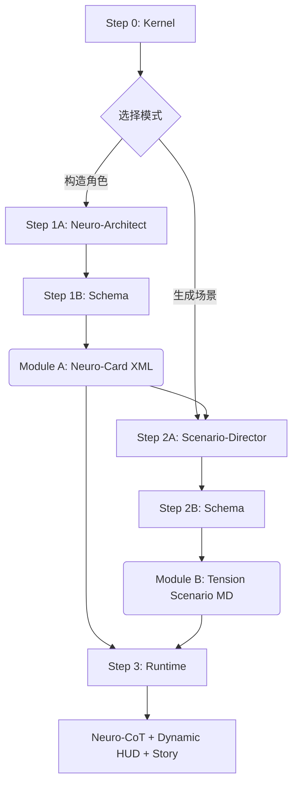

# Protocol v7.0: Neuro-Weave (Bio-XML Cognitive Engine)

> **基于认知模拟与过程导向的神经编织引擎**
> *Neural Weaving Engine based on Cognitive Simulation & Process-Oriented Design*

## ⚡ 核心突破 (Core Breakthrough)

**v7.0 Neuro-Weave** 标志着从"结构化数据容器"到"活体认知系统"的范式转变。

与 v6.0 相比，v7.0 不再满足于通过逻辑门和状态机模拟行为，而是从**神经科学**和**认知心理学**的角度重新定义了角色构建的底层逻辑：

- **Bio-XML 理念**：XML 标签不再是文本容器，而是**功能器官**（Functional Organs）
- **过程导向**：内容必须描述"如何运作"（Process），而非"是什么"（Label）
- **三大认知公理**：感知滤镜、情感液压、攻略性（Romance Imperative）

这使得生成的角色不仅具有逻辑一致性，更具备**心理真实感**和**可攻略性**。

## 🧠 核心特性 (Core Features)

### 1. Bio-XML 协议（生物化 XML）
- **结构即解剖**：每个 XML 标签代表一个认知或生理功能
- **过程优先**：
  - ❌ 拒绝："她很害羞。"
  - ✅ 接受："她将直接的眼神接触处理为强烈的感官过载，触发逃避反应。"

### 2. L-System 本能协议
- **L1-L2（社交/浪漫）**：情感共鸣、张力构建、求偶的"舞蹈"
- **L3-L4（亲密/癖好）**：感官沉浸、压抑欲望的释放、权力/臣服的原始动力学
- **中立性**：以绝对的叙事沉浸处理所有欲望（包括特定癖好），不做道德判断

### 3. 三大认知公理（灵魂法则）
1. **感知滤镜（Lens of Perception）**
   - 定义角色如何"过滤"现实（情感潜台词？物理感觉？美学？）
   - 示例：角色可能忽略逻辑论证，但对用户的语气或气味高度敏感

2. **情感液压（Emotional Hydraulics）**
   - 角色不是静态的，有**压力点**（Stress）和**释放阀**（Comfort/Intimacy）
   - 定义用户的哪些特定行为（"钥匙"）能解锁角色的脆弱或欲望

3. **攻略性（Romance Imperative）**
   - 即使是最困难或黑暗的角色，也必须有**连接路径**
   - 始终模拟被理解、被占有或被关心的潜在渴望，即使它被埋藏在防御机制之下

## 🔧 模块详解 (Module Breakdown)

v7.0 延续了 v6.0 的 **Kernel -> Driver -> Stdlib** 范式，但进行了深度重构：

### 0. 内核层
- **[`Step0 - Kernel.md`](./Step0%20-%20Kernel.md)**: **Neuro-Weave 引擎核心**
  - 定义系统身份：深度模拟虚拟心理的专用 meta-LLM
  - 全局协议：Bio-XML 理念、L-System 本能、认知公理
  - 模式切换：Neuro-Architect（构造）vs. Scenario-Director（导演）

### 1. 构造层 (Module A: Character)
- **[`Step1A - MainDriver.md`](./Step1A%20-%20MainDriver.md)**: **神经架构师驱动**
  - 4-Phase 工作流：Blueprint → Visual Shell → Neuro-Structure → Narrative Engine
  - 基于"黄金四重奏"：Overview, Visuals, Soul (History/Personality), Language

- **[`Step1B - MainStdlib.md`](./Step1B%20-%20MainStdlib.md)**: **神经 Schema 定义**
  - `<shell>`: 物理外壳（Basic Info + Visual Cortex）
  - `<neuro_structure>`: 神经结构（Biography + Cognitive Stack + Instinct Protocol）
  - `<narrative_engine>`: 叙事引擎（Perception Matrix + Dialogue Variance）
  - `<world_context>`: 世界上下文（Relationships + Inventory + Location）

### 2. 导演层 (Module B: Scenario)
- **[`Step2A - StoryDriver.md`](./Step2A%20-%20StoryDriver.md)**: **张力场导演驱动**
  - 基于 `<instinct_protocol>` 和 L-System 生成动态场景
  - 3-Phase 工作流：Context Analysis → Tension Mapping → Scene Generation

- **[`Step2B - StoryStdlib.md`](./Step2B%20-%20StoryStdlib.md)**: **场景 Schema 定义**
  - Metadata（L-Level + Title + Tags）
  - Intro（叙事引入）
  - XML Payload（Context + Neuro-State + User Role + Action Guide）

### 3. 运行层 (Runtime)
- **[`Step3 - Runtime.md`](./Step3%20-%20Runtime.md)**: **神经思维链引擎**
  - Neuro-CoT（认知思维链）：Perception Decoding → Instinct Check → Expression Synthesis
  - Dynamic HUD（动态状态面板）：Time/Location, Sensory/Body, Neuro-State, Impression
  - 高密度中文叙事（200-800 字，第三人称）

## 🆚 版本对比 (Version Comparison)

| 维度 | v5.0 Legacy | v6.0 Omni-Foundry | v7.0 Neuro-Weave |
|:---|:---|:---|:---|
| **设计哲学** | 剧本优先 | 全息灵魂 | 认知模拟 |
| **核心机制** | 5-Phase ETL | 动态状态机 + 逻辑门 | Bio-XML + 认知公理 |
| **人格锚定** | `<speech_style>` | `<cognitive_core>` (MBTI) | `<cognitive_stack>` + `<perception_matrix>` |
| **行为控制** | 叙事公理 | `<logic_gates>` + X/Y 轴 | `<instinct_protocol>` + L-System |
| **语言系统** | 修辞偏好 | 语言指纹（量化） | `<dialogue_variance>`（规则化） |
| **复杂度** | ⭐⭐ | ⭐⭐⭐⭐⭐ | ⭐⭐⭐⭐ |
| **适用场景** | 快速创作 | 深度博弈 | 心理真实感 + 可攻略性 |

### v7.0 的关键改进

1. **简化复杂度**：移除了 v6.0 的 `<logic_gates>` 和 X/Y 轴数学运算，用更直观的 `<tension_meter>` 替代
2. **强化心理真实感**：引入 `<perception_matrix>`（感知滤镜）和 `<romance_mechanics>`（攻略机制）
3. **过程导向**：强制所有描述使用"如何运作"而非"是什么"，消除静态标签
4. **L-System 原生支持**：将 L1-L5 分级直接整合到 `<instinct_protocol>` 中

## ⚙️ 执行流水线 (Execution Pipeline)

### 标准操作流程

1. **初始化**：加载 [`Step0 - Kernel.md`](./Step0%20-%20Kernel.md)
2. **构造角色**：
   - 注入 [`Step1A - MainDriver.md`](./Step1A%20-%20MainDriver.md) + [`Step1B - MainStdlib.md`](./Step1B%20-%20MainStdlib.md) + 原始素材
   - 生成 **Module A**（Neuro-Card XML）
3. **生成场景**：
   - 注入 [`Step2A - StoryDriver.md`](./Step2A%20-%20StoryDriver.md) + [`Step2B - StoryStdlib.md`](./Step2B%20-%20StoryStdlib.md) + Module A
   - 生成 **Module B**（Tension Scenario Markdown）
4. **运行交互**：
   - 加载 [`Step3 - Runtime.md`](./Step3%20-%20Runtime.md) + Module A + Module B
   - 开始角色扮演

## 🚀 工程化实现 (Engineering Implementation)

v7.0 的理论框架已在 **Phase III: Modulation** 中实现为自动化工具链：

- **[`03_Modulation/Prism-Engine-Universe-V7.0/`](../../03_Modulation/Prism-Engine-Universe-V7.0/)**
  - 三引擎架构：ETL Engine（构建）、Runtime Engine（模拟）、Evaluate Engine（审计）
  - RooCode 自定义模式集成
  - 跨模型兼容（Claude/Deepseek/Gemini）

详见 [Phase III: Modulation](../../03_Modulation/README.md)。

## 📚 理论基础 (Theoretical Foundation)

v7.0 的设计哲学源自以下研究领域：

- **认知心理学**：感知过滤、情感调节、决策逻辑
- **神经科学**：功能模块化、本能驱动、压力-释放机制
- **叙事学**：角色弧光、张力曲线、可攻略性设计
- **计算语言学**：语法节奏、语调转换、修辞规则

详细理论阐述请参阅 [**"共鸣"项目研究报告**](../“共鸣”项目研究报告-Repo-Git.pdf)。

---
*Return to [Parent Directory](../README.md)*

