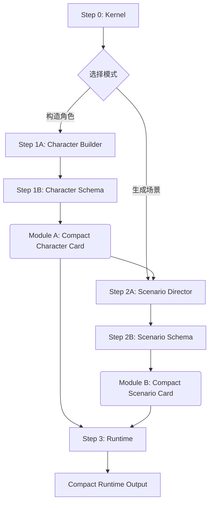

# Protocol v8.0: Compact-State Update (紧凑态更新)

> **FurryBar Engine 的 v8 主题更新：以 YAML/Markdown 轻骨架压缩格式性文本开销，保护正文空间与注意力密度**
> *The v8 theme update for FurryBar Engine: reducing structural prompt overhead with a lighter YAML/Markdown skeleton*

## ⚡ 核心突破 (Core Breakthrough)

**v8.0 Compact-State Update** 是 **FurryBar Engine** 在协议层的一次主题更新。

在 v7.0 Neuro-Weave 架构中，Bio-XML 被证明能够有效维持长程叙事中的逻辑稳定性。然而，当协议真正进入高密度生产环境后，一个更现实的问题浮现出来：**格式性文本本身会持续挤占上下文预算，稀释正文生成的有效空间，并污染模型对叙事主体的注意力分配**。

因此，v8.0 的核心目标是更进一步地解决 **Prompt 中结构负担过重** 的问题：
- **YAML Frontmatter 负责最小必要硬状态（Hard State）**：仅保留那些需要稳定索引、可反写、可复用的短字段
- **Markdown Body 负责软认知（Soft Cognition）**：用自然语言标题树承载认知机制、叙事风格与心理结构
- **Compact-State 原则**：凡是能缩短、合并、降维的格式性文本，都应被压缩，让更多注意力和 token 预算留给真正的正文生成

## 🧠 核心特性 (Core Features)

### 1. 紧凑态架构（Compact-State Architecture）
- **轻骨架，重正文**：结构只保留索引作用，不再承担过多解释性负担
- **YAML for State**：适合机器读写的短状态字段
- **Markdown for Cognition**：适合模型吸收的心理与叙事机制
- **单文件原则**：角色卡与场景卡依然维持单文件分发能力

### 2. 注意力保护（Attention Protection）
- **压缩格式性文本**：减少标签、注释、样板解释对上下文的占用
- **保护正文空间**：把更多 token 留给环境描写、动作、感官流与对话推进
- **降低结构污染**：让模型把注意力集中在角色与剧情，而不是结构本身

### 3. L-System 本能协议
- **L1-L2（社交/浪漫）**：情感共鸣、张力构建、求偶的"舞蹈"
- **L3（亲密与激情）**：
  - **L3-A（柔和亲密 — R-15）**：感性但不露骨，聚焦氛围、张力与前戏。可选，适合渐进式张力构建
  - **L3-B（纯爱 — R-18）**："純愛"（Jun-Ai），双方自愿、充满激情、情感满足的肉体结合
- **L4（癖好与心理 — R-18）**：压抑欲望的释放、权力/臣服的原始动力学
- **L5（极端）**：条件性解锁，需要明确请求
- **中立性**：以绝对叙事沉浸处理所有欲望，不做道德判断

### 4. 三大认知公理（灵魂法则）
1. **感知滤镜（Lens of Perception）**：定义角色如何过滤现实
2. **情感液压（Emotional Hydraulics）**：定义压力点与释放阀
3. **可攻略的裂隙（Romanceable Flaw）**：定义角色可被触达的心理缺口

### 5. 运行时轻量化（Runtime Minimalism）
- **标准库回归模板本质**：[`Step1B - MainStdlib.md`](./Step1B%20-%20MainStdlib.md) 与 [`Step2B - StoryStdlib.md`](./Step2B%20-%20StoryStdlib.md) 只负责提供结构蓝图
- **运行规则集中在 [`Step3 - Runtime.md`](./Step3%20-%20Runtime.md)**：避免规则说明散落到模板文件中
- **最小可见骨架**：运行时只保留必要的 CoT / HUD / 正文三段结构

## 🔧 模块详解 (Module Breakdown)

v8.0 延续了 v7.0 的 **Kernel -> Driver -> Stdlib** 范式，但把协议目标从“强化结构”调整为“**缩减结构负担**”。

### 0. 内核层
- **[`Step0 - Kernel.md`](./Step0%20-%20Kernel.md)**: **FurryBar Engine v8.0 Compact-State 内核**
  - 定义系统身份：深度模拟虚拟心理的专用 meta-LLM
  - 全局协议：轻骨架原则、L-System 本能、认知公理
  - 核心主张：减少格式性文本对注意力与正文空间的挤占
  - 模式切换：Character Builder（构造）vs. Scenario Director（导演）

### 1. 构造层 (Module A: Character)
- **[`Step1A - MainDriver.md`](./Step1A%20-%20MainDriver.md)**: **角色构建驱动**
  - 4-Phase 工作流：Blueprint → Shell → Neuro-Structure → Handover
  - 基于“黄金四重奏”：Overview, Visuals, Soul, Language
  - 输出为单文件角色卡：YAML Frontmatter + Markdown Body

- **[`Step1B - MainStdlib.md`](./Step1B%20-%20MainStdlib.md)**: **角色标准库模板**
  - 提供角色卡的最小稳定结构
  - 用 Frontmatter 承载短状态，用 Body 承载长认知
  - 强调 process-oriented 写法，压缩不必要结构噪声

### 2. 导演层 (Module B: Scenario)
- **[`Step2A - StoryDriver.md`](./Step2A%20-%20StoryDriver.md)**: **张力场导演驱动**
  - 基于 `Instinct Protocol` 和 L-System 生成动态场景
  - 3-Phase 工作流：Consultation → Ideation → Production
  - 保留文化匹配与开场风格控制

- **[`Step2B - StoryStdlib.md`](./Step2B%20-%20StoryStdlib.md)**: **场景标准库模板**
  - 提供单文件场景卡的最小稳定结构
  - 让 YAML 只保留可复用场景状态
  - 把开场段落置于前方，保证阅读与生成的直达性

### 3. 运行层 (Runtime)
- **[`Step3 - Runtime.md`](./Step3%20-%20Runtime.md)**: **FurryBar 沉浸式运行时**
  - 10 叙事公理（不可变法则）+ 反AI味约束
  - Compact Runtime：Neuro-CoT → HUD → Main Content
  - 注意力保护：结构必须短，正文必须密
  - 高密度中文叙事（200-800 字，第三人称）

## 🆚 版本对比 (Version Comparison)

| 维度 | v5.0 Legacy | v6.0 Omni-Foundry | v7.0 Neuro-Weave | v8.0 Compact-State Update |
|:---|:---|:---|:---|:---|
| **设计哲学** | 剧本优先 | 全息灵魂 | 认知模拟 | 紧凑态认知 |
| **引擎命名** | FurryBar Engine | FurryBar Engine | FurryBar Neuro-Weave Engine | FurryBar Engine |
| **主题更新** | Legacy | Omni-Foundry | Neuro-Weave | Compact-State |
| **数据格式** | XML | XML | Bio-XML | YAML + Markdown |
| **核心目标** | 快速成卡 | 深度控制 | 心理真实感 | 结构降维 + 正文保护 |
| **核心机制** | 5-Phase ETL | 动态状态机 + 逻辑门 | Bio-XML + 认知公理 | Compact-State + 最小骨架 |
| **格式开销** | 中 | 高 | 很高 | 低 |
| **注意力污染** | 中 | 高 | 中 | 低 |
| **复杂度** | ⭐⭐ | ⭐⭐⭐⭐⭐ | ⭐⭐⭐⭐⭐ | ⭐⭐⭐⭐ |
| **适用场景** | 快速创作 | 深度博弈 | 心理真实感 | 工业化生产 + 上下文节流 |

### v8.0 的关键改进

1. **压缩格式负担**：把原本由 XML 标签、注释、层级包裹占据的大量结构性 token 压缩到最小
2. **保护正文预算**：让模型把更多上下文资源用于动作、心理、环境、感官与对话推进
3. **降低注意力污染**：减少结构词、字段词、标签词对叙事主体的竞争
4. **维持稳定索引**：保留 YAML Frontmatter 作为最小必要的可读写状态层
5. **继承 v7 灵魂**：保留认知公理、L-System 与叙事公理，不牺牲角色深度

## ⚙️ 执行流水线 (Execution Pipeline)

### 标准操作流程

1. **初始化**：加载 [`Step0 - Kernel.md`](./Step0%20-%20Kernel.md)
2. **构造角色**：
   - 注入 [`Step1A - MainDriver.md`](./Step1A%20-%20MainDriver.md) + [`Step1B - MainStdlib.md`](./Step1B%20-%20MainStdlib.md) + 原始素材
   - 生成 **Module A**（紧凑态角色卡）
3. **生成场景**：
   - 注入 [`Step2A - StoryDriver.md`](./Step2A%20-%20StoryDriver.md) + [`Step2B - StoryStdlib.md`](./Step2B%20-%20StoryStdlib.md) + Module A
   - 生成 **Module B**（紧凑态场景卡）
4. **运行交互**：
   - 加载 [`Step3 - Runtime.md`](./Step3%20-%20Runtime.md) + Module A + Module B
   - 开始角色扮演

## 🏗️ 为什么选择紧凑态更新？

1. **因为长上下文不是无限免费的**：格式性文本越多，正文可用空间越少
2. **因为结构不是目的，叙事才是目的**：协议存在的意义是支撑文本，不是与文本争抢注意力
3. **因为工业化生产需要轻骨架**：在自动化流水线中，过重的结构包装会持续抬高 token 成本与注意力成本

## 🚀 工程化实现 (Engineering Implementation)

v8.0 的理论方向更贴近下一代工程化需求：
- 通过更轻的结构骨架降低长期运行成本
- 为脚本读写保留必要状态层，但不再过度膨胀格式体积
- 为后续工具链升级提供“轻结构、高正文占比”的协议基础

详见 [Phase III: Modulation](../../03_Modulation/README.md)。

## 📚 理论基础 (Theoretical Foundation)

v8.0 的设计哲学源自以下研究问题：
- **注意力稀释（Attention Dilution）**：长上下文下，模型对关键人格信息的聚焦会下降
- **格式污染（Structural Pollution）**：结构性文本过多会挤压正文生成空间
- **叙事带宽分配（Narrative Bandwidth Allocation）**：有限上下文预算应优先让给真正推动沉浸感的文本
- **软件工程中的降维思想**：用更轻的结构实现足够稳定的控制能力

详细理论阐述请参阅 [**“共鸣”项目研究报告**](../“共鸣”项目研究报告-Repo-Git.pdf)。

---
*Return to [Parent Directory](../README.md)*
