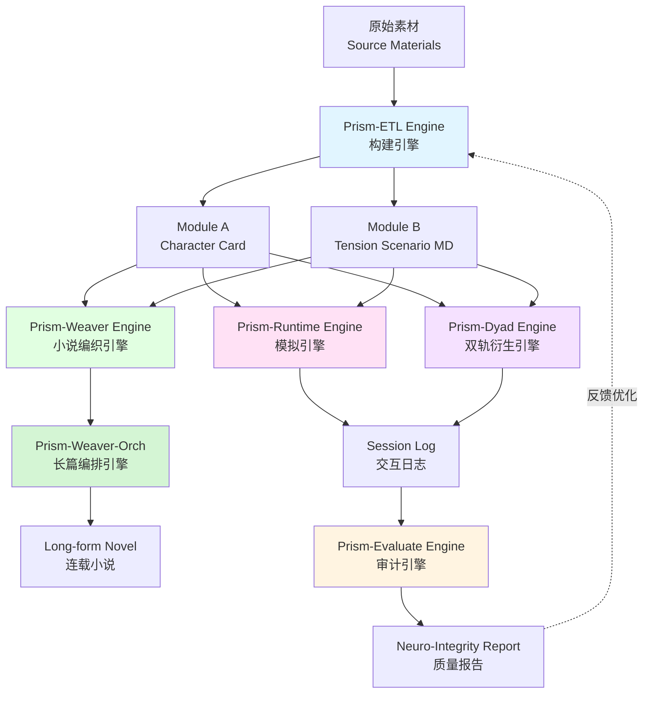

# Phase III: Modulation (调制)

> **基于 VSCode + RooCode 的自动化角色铸造流水线**
> *IDE-Native Automated Character Foundry based on VSCode & RooCode*

## 🌔 项目概述 (Overview)

**Phase III: Modulation** 是 "Neural Narratology" 计划的工程化终章。

面对 Phase II 协议的复杂度，手工编写 XML 已不再现实。本项目引入了 **Prism Engine 矩阵架构** —— 一套运行在 VSCode 环境中的虚拟智能体系统。它利用 RooCode 插件的能力，将 LLM 从"聊天机器人"重塑为"文件系统操作员"，实现了从原始素材到最终资产的 **Zero-Copy** 自动化生产。

### 核心突破

- **六引擎矩阵架构**：ETL（构建）、Runtime（模拟）、Evaluate（审计）、Weaver（小说）、Dyad（数据）、Weaver-Orch（编排器）形成完整生态
- **v7.0 Neuro-Weave 实现**：将 Phase II 的理论框架转化为可执行的工程工具（Prism-Engine-V7.x）
- **v8.0 Compact-State 实现**：从 Bio-XML 转向 YAML+Markdown 轻骨架架构，新增 Story Bible 世界状态层（Prism-Engine-V8.x）
- **Lite Persona Prompt 输出**：ETL 现可直接锻造面向单一 System Prompt 聊天宿主的角色主提示词
- **跨模型兼容**：针对 Claude/Deepseek/Gemini 的特性优化
- **RooCode 原生集成**：通过自定义模式实现无缝工作流

## 🏗️ 架构设计 (Architecture)



### 六大引擎职责

| 引擎 | 模式 | 职责 | 输入 | 输出 |
|:---|:---|:---|:---|:---|
| **ETL Engine** | `prism-etl` | 构建角色、场景与 Lite 主提示词 | 原始素材 | Module A (.xml/.md) + Module B (.md) + Lite Persona Prompt (.md) |
| **Runtime Engine** | `prism-runtime` | 执行角色单向模拟 | Module A + Module B | Session Log (MD) |
| **Evaluate Engine** | `prism-evaluate` | 质量审计 | Source + Card + Log | Neuro-Integrity Report (MD) |
| **Weaver Engine** | `prism-weaver` | 扩写生成长篇小说 | Module A + Module B | Long-form Novel (MD) |
| **Weaver-Orch Engine** | `prism-weaver-orch` | 长篇编排器（Orchestrator） | Module A + Module B + Story Bible | Multi-Chapter Novel (MD) |
| **Dyad Engine** | `prism-dyad` | 双角色自动博弈生成数据 | Module A + Module B | Session Log (MD) |

## 📦 目录结构 (Directory Structure)

### 核心工程目录

本项目包含多个针对不同协议版本和模型优化的实现：

- **[`Prism-Engine-V9.x/`](./Prism-Engine-V9.x/)**: **V9.x 通用版本**（⭐ 最新推荐）
  - 基于 v9.0 State-Space 协议
  - 包含完整的**六引擎**系统提示词（ETL/Runtime/Evaluate/Weaver/Weaver-Orch/Dyad）
  - 新增 **Persona Topology**（不变轴 / 可变轴 / 边界条件）与 **State Navigator**
  - ETL 新增 **Affine Transform Agent（工作流 C）** 与 **L3+ DLC 文档**输出
  - 场景卡改用 **beat_map** 结构，Runtime 输出三段式（Neural Chain + HUD + 正文）
- **[`Prism-Engine-V9.x-Installer/`](./Prism-Engine-V9.x-Installer/)**: **V9.x 安装器与模板分发目录**
  - 提供 `Install.ps1` 一键安装脚本
  - 支持 **Mode A（模板内置 `.roo` 提示词）** 与 **Mode B（用户目录 Rules Pack）**
  - 内含 V9.0 Project Template、六引擎预设 YAML、Rules XML 与补丁文件
- **[`Prism-Engine-Codex/`](./Prism-Engine-Codex/)**: **Codex 宿主适配目录**
  - 面向 **Codex CLI** 的宿主层落地
  - 以局部 `AGENTS.md` 组织六引擎作用域
  - 协议层已对齐 **v9.0 State-Space**
  - 共享 `specs/`、`templates/`、`scripts/` 资产，含 Lite Persona Prompt 与 `schema_dlc.md`
  - 长篇正文采用 `Scene Shards` 协议写入 `novels/{project}/chapters/`
- **[`Prism-Engine-Claude-Code/`](./Prism-Engine-Claude-Code/)**: **Claude Code 宿主适配目录**
  - 面向 **Claude Code CLI** 的宿主层落地
  - 以目录作用域 `CLAUDE.md` 组织六引擎行为边界
  - 自然语言触发 + 目录作用域双轨引擎切换
  - Agent 工具子代理委派（Weaver-Orch → Weaver/Evaluate）
  - AskUserQuestion 实现 Stop & Wait 协议
  - 共享 `specs/`、`templates/`、`scripts/` 资产，含 Lite Persona Prompt
- **[`Prism-Engine-V8.x/`](./Prism-Engine-V8.x/)**: **V8.x 通用版本**
  - 基于 v8.0 Compact-State 协议
  - 包含完整的**六引擎**系统提示词（ETL/Runtime/Evaluate/Weaver/Weaver-Orch/Dyad）
  - 从 Bio-XML 转向 **YAML+Markdown 轻骨架**架构
  - ETL 新增 **Lite Persona Prompt** 输出 Profile
  - 新增 **Story Bible 世界状态层**与**结构化 Outline**
  - 内含 `presets/` 子目录，存放六引擎预设 YAML 配置
- **[`Prism-Engine-V8.x-Installer/`](./Prism-Engine-V8.x-Installer/)**: **V8.x 安装器与模板分发目录**
  - 提供 `Install.ps1` 一键安装脚本
  - 支持 **Mode A（模板内置 `.roo` 提示词）** 与 **Mode B（用户目录 Rules Pack）**
  - 内含 V8.0 Project Template、六引擎预设 YAML、Rules XML 与补丁文件

- **[`Prism-Engine-V7.x/`](./Prism-Engine-V7.x/)**: **V7.x 通用版本**
  - 基于 v7.0 Neuro-Weave 理论
  - 包含完整的五引擎系统提示词（ETL/Runtime/Evaluate/Weaver/Dyad）
  - 跨模型兼容设计
  - 内含 `presets/` 子目录，存放五引擎预设 YAML 配置
- **[`Prism-Engine-V7.x-Installer/`](./Prism-Engine-V7.x-Installer/)**: **V7.x 安装器与模板分发目录**
  - 提供 `Install.ps1` 一键安装脚本
  - 支持 **Mode A（模板内置 `.roo` 提示词）** 与 **Mode B（用户目录 Rules Pack）**
  - 内含 V7.0 Project Template、预设 YAML、Rules XML 与补丁文件
  
- **[`Prism-Engine-V6.x/`](./Prism-Engine-V6.x/)**: **V6.x 多模型 ETL 专项目录**
  - **[`Prism-ETL-Claude/`](./Prism-Engine-V6.x/Prism-ETL-Claude/)**: Claude 优化版本（当前为 ETL 专项）
  - **[`Prism-ETL-Deepseek/`](./Prism-Engine-V6.x/Prism-ETL-Deepseek/)**: Deepseek 优化版本（当前为 ETL 专项）
  - **[`Prism-ETL-Gemini/`](./Prism-Engine-V6.x/Prism-ETL-Gemini/)**: Gemini 优化版本（当前为 ETL 专项）

### 版本能力矩阵

| 版本目录 | 协议代际侧重 | 已提供引擎 |
|:---|:---|:---|
| `Prism-Engine-V8.x` | v8.0 Compact-State | `etl` + `runtime` + `evaluate` + `weaver` + `weaver-orch` + `dyad` |
| `Prism-Engine-Codex` | v9.0 State-Space / Codex 宿主适配 | 六引擎目录作用域（AGENTS.md + shared/prompts） |
| `Prism-Engine-Claude-Code` | v9.0 State-Space / Claude Code 宿主适配 | 六引擎目录作用域（CLAUDE.md + shared/prompts + Agent 子代理） |
| `Prism-Engine-V7.x` | v7.0 Neuro-Weave | `etl` + `runtime` + `evaluate` + `weaver` + `dyad` |
| `Prism-Engine-V6.x/Prism-ETL-Claude` | v6.x Holographic / ETL 专项 | `etl` |
| `Prism-Engine-V6.x/Prism-ETL-Deepseek` | v6.x Holographic / ETL 专项 | `etl` |
| `Prism-Engine-V6.x/Prism-ETL-Gemini` | v6.x Holographic / ETL 专项 | `etl` |

### 协议代际路线图 (Roadmap)

- **当前状态**：
  - `Prism-Engine-V8.x` 为 v8.1 完整实现（六引擎），RooCode 宿主。
  - `Prism-Engine-Codex` 为 v9.0 Codex CLI 宿主适配（六引擎目录作用域）。
  - `Prism-Engine-Claude-Code` 为 v9.0 Claude Code CLI 宿主适配（六引擎目录作用域 + Agent 子代理委派）。
  - `Prism-Engine-V7.x` 为 v7.0 完整实现（五引擎）。
  - `Prism-Engine-V6.x/Prism-ETL-Claude` / `Prism-Engine-V6.x/Prism-ETL-Deepseek` / `Prism-Engine-V6.x/Prism-ETL-Gemini` 为 v6.x 语义的 ETL 专项分支。
- **升级目标**：
  1. 先将三模型分支的 `specs/` 与 `templates/` 对齐至 v7.0 Neuro-Card / Tension Scenario 结构。
  2. 再补齐 `runtime` 与 `evaluate` 引擎提示词，形成可测试闭环。
  3. 最后扩展 `weaver` 与 `dyad`，完成与 Universe 分支的能力并轨。
- **发布原则**：
  - 以“文档、模板、提示词三者一致”为准，未达一致前不标注为 v7 完整分支。

### 标准工程结构

#### V8.x 结构（最新）

```
Prism-Engine-V8.x/
├── .roo/                           # 系统级提示词（六引擎）
│   ├── system-prompt-prism-etl
│   ├── system-prompt-prism-runtime
│   ├── system-prompt-prism-evaluate
│   ├── system-prompt-prism-weaver
│   ├── system-prompt-prism-weaver-orch  # V8.1 新增
│   └── system-prompt-prism-dyad
├── presets/                        # 六引擎预设 YAML 配置
│   ├── prism-etl_preset.yaml
│   ├── prism-runtime_preset.yaml
│   ├── prism-evaluate_preset.yaml
│   ├── prism-weaver_preset.yaml
│   ├── prism-weaver-orch_preset.yaml    # V8.1 新增
│   └── prism-dyad_preset.yaml
├── specs/                          # Schema 定义（6 个）
│   ├── schema_character.md         # Module A (Compact Character Card)
│   ├── schema_persona_prompt_immersive.md  # Lite 第一人称主提示词
│   ├── schema_persona_prompt_compatible.md # Lite 第三人称主提示词
│   ├── schema_scenario.md          # Module B (Scenario)
│   ├── schema_story_bible.md       # Story Bible 世界状态层（V8.1 新增）
│   └── schema_outline.md           # 结构化大纲（V8.1 新增）
├── templates/                      # 样板代码（6 个，YAML+MD 格式）
│   ├── tpl_module_a.md             # 角色模板
│   ├── tpl_persona_prompt_immersive.md     # Lite 第一人称模板
│   ├── tpl_persona_prompt_compatible.md    # Lite 第三人称模板
│   ├── tpl_module_b.md             # 场景模板
│   ├── tpl_story_bible.md          # Story Bible 模板（V8.1 新增）
│   └── tpl_outline.md              # 大纲模板（V8.1 新增）
├── source_materials/               # 原始素材目录
├── workspace/                      # 工作区（生成的 MD）
│   └── lite/                       # Lite 单一 System Prompt 输出
├── test_runs/                      # 模拟日志目录
├── novels/                         # 长篇小说目录
└── reports/                        # 评估报告目录
```

#### V7.x 结构

```
Prism-Engine-V7.x/
├── .roo/                           # 系统级提示词（五引擎）
│   ├── system-prompt-prism-etl
│   ├── system-prompt-prism-runtime
│   ├── system-prompt-prism-evaluate
│   ├── system-prompt-prism-weaver
│   └── system-prompt-prism-dyad
├── presets/                        # 五引擎预设 YAML 配置
│   ├── prism-etl_preset.yaml
│   ├── prism-runtime_preset.yaml
│   ├── prism-evaluate_preset.yaml
│   ├── prism-weaver_preset.yaml
│   └── prism-dyad_preset.yaml
├── specs/                          # Schema 定义（2 个）
│   ├── schema_character.md         # Module A (Neuro-Card XML)
│   └── schema_scenario.md          # Module B (Scenario)
├── templates/                      # 样板代码（2 个，XML 格式）
│   ├── tpl_module_a.xml            # 角色模板
│   └── tpl_module_b.md             # 场景模板
├── source_materials/               # 原始素材目录
├── workspace/                      # 工作区（生成的 XML/MD）
├── test_runs/                      # 模拟日志目录
├── novels/                         # 长篇小说目录
└── reports/                        # 评估报告目录
```

Claude/Deepseek/Gemini 目录当前最小结构为：

```
Prism-Engine-V6.x/
├── Prism-ETL-Claude/
├── Prism-ETL-Deepseek/
└── Prism-ETL-Gemini/
    ├── .roo/
    │   └── system-prompt-prism-etl
    ├── specs/
    ├── templates/
    ├── source_materials/
    └── workspace/
```

### 配置文件

**V8.x 配置（六引擎）**：
- **[`Prism-Engine-V8.x/presets/prism-etl_preset.yaml`](./Prism-Engine-V8.x/presets/prism-etl_preset.yaml)**: ETL 引擎模式配置
- **[`Prism-Engine-V8.x/presets/prism-runtime_preset.yaml`](./Prism-Engine-V8.x/presets/prism-runtime_preset.yaml)**: Runtime 引擎模式配置
- **[`Prism-Engine-V8.x/presets/prism-evaluate_preset.yaml`](./Prism-Engine-V8.x/presets/prism-evaluate_preset.yaml)**: Evaluate 引擎模式配置
- **[`Prism-Engine-V8.x/presets/prism-weaver_preset.yaml`](./Prism-Engine-V8.x/presets/prism-weaver_preset.yaml)**: Weaver 引擎模式配置
- **[`Prism-Engine-V8.x/presets/prism-weaver-orch_preset.yaml`](./Prism-Engine-V8.x/presets/prism-weaver-orch_preset.yaml)**: Weaver-Orch 引擎模式配置（V8.1 新增）
- **[`Prism-Engine-V8.x/presets/prism-dyad_preset.yaml`](./Prism-Engine-V8.x/presets/prism-dyad_preset.yaml)**: Dyad 引擎模式配置
- **[`Prism-Engine-V8.x-Installer/custom_modes_patch.yaml`](./Prism-Engine-V8.x-Installer/custom_modes_patch.yaml)**: Rules 模式下可整体并入 `custom_modes.yaml` 的补丁集合

**V7.x 配置（五引擎）**：
- 参见 [`Prism-Engine-V7.x/presets/`](./Prism-Engine-V7.x/presets/) 和 [`Prism-Engine-V7.x-Installer/`](./Prism-Engine-V7.x-Installer/)

## 🛠️ 安装与配置 (Setup)

### 前置要求

- [VSCode](https://code.visualstudio.com/)
- [RooCode Extension](https://marketplace.visualstudio.com/items?itemName=RooVeterinaryInc.roo-cline) (原 Cline)
- 若要使用 Project Template 安装方式，请额外安装 VSCode 的 Project Templates 插件
- LLM API-Key（推荐使用与选定版本匹配的模型）

### 引导流程 (The MBR Boot Sequence)

为了让 RooCode 正确识别 Prism 引擎，推荐优先使用安装器；手动注入方式仍然保留为兜底路径。

#### 推荐方式：运行 V7.x 安装器

1. **进入安装器目录**:
   - 打开 [`Prism-Engine-V7.x-Installer/`](./Prism-Engine-V7.x-Installer/)
   - 参考 [`Prism-Engine-V7.x-Installer/README.md`](./Prism-Engine-V7.x-Installer/README.md:1)

2. **运行安装脚本**:

```powershell
powershell -ExecutionPolicy Bypass -File .\03_Modulation\Prism-Engine-V7.x-Installer\Install.ps1 -Mode A -Backup
```

或安装 **Mode B / Rules 模式**：

```powershell
powershell -ExecutionPolicy Bypass -File .\03_Modulation\Prism-Engine-V7.x-Installer\Install.ps1 -Mode B -Backup
```

3. **模式区别**:
   - **Mode A**：把模板连同 `.roo/system-prompt-*` 一起复制到 VSCode Project Templates 目录，适合传统工作区内置提示词流。
   - **Mode B**：把 `rules-prism-*` 安装到 `%USERPROFILE%\.roo\`，并复制一份不带模板提示词的 Project Template，适合基于全局 Rules Pack 的工作流。

4. **验证安装**:
   - VSCode 的 Project Templates 中应出现 `Prism-Engine-Universe-V7.0-Template`
   - RooCode 模式切换器中应出现五个 Prism 模式

#### 推荐方式 C：运行 V8.x 安装器（最新）

1. **进入安装器目录**:
   - 打开 [`Prism-Engine-V8.x-Installer/`](./Prism-Engine-V8.x-Installer/)
   - 参考 [`Prism-Engine-V8.x-Installer/README.md`](./Prism-Engine-V8.x-Installer/README.md:1)

2. **运行安装脚本**:

```powershell
powershell -ExecutionPolicy Bypass -File .\03_Modulation\Prism-Engine-V8.x-Installer\Install.ps1 -Mode A -Backup
```

或安装 **Mode B / Rules 模式**：

```powershell
powershell -ExecutionPolicy Bypass -File .\03_Modulation\Prism-Engine-V8.x-Installer\Install.ps1 -Mode B -Backup
```

3. **验证安装**:
   - VSCode 的 Project Templates 中应出现 `Prism-Engine-Universe-V8.0-Template`
   - RooCode 模式切换器中应出现**六个** Prism 模式（etl/runtime/evaluate/weaver/weaver-orch/dyad）

#### 手动方式：追加自定义模式 YAML

如果你不想运行脚本，也可以手动注入自定义模式：

1. **加载配置文件**:
   - 打开 RooCode 设置 → `Custom Modes`
   - 将以下所有的配置文件内容追加到配置中：
     - [`prism-etl_preset.yaml`](./Prism-Engine-V7.x/presets/prism-etl_preset.yaml:1)
     - [`prism-runtime_preset.yaml`](./Prism-Engine-V7.x/presets/prism-runtime_preset.yaml:1)
     - [`prism-evaluate_preset.yaml`](./Prism-Engine-V7.x/presets/prism-evaluate_preset.yaml:1)
     - [`prism-weaver_preset.yaml`](./Prism-Engine-V7.x/presets/prism-weaver_preset.yaml:1)
     - [`prism-dyad_preset.yaml`](./Prism-Engine-V7.x/presets/prism-dyad_preset.yaml:1)
   - *或者*：在 RooCode 聊天框中批量上传文件并指示："Load these custom mode configurations."
   - 若采用 Rules 模式，也可直接并入 [`Prism-Engine-V7.x-Installer/custom_modes_patch.yaml`](./Prism-Engine-V7.x-Installer/custom_modes_patch.yaml:1)

2. **选择工作目录**:
   - 在 VSCode 中打开 [`Prism-Engine-V7.x/`](./Prism-Engine-V7.x/) 作为工作区根目录
   - Mode A 需确保 RooCode 能够访问 [`.roo/`](./Prism-Engine-V7.x/.roo/) 目录
   - Mode B 需确保 `%USERPROFILE%\.roo\rules-prism-*` 已安装完成

3. **验证安装**:
   - 在 RooCode 模式切换器中应该能看到以下新模式：
     - **Prism ETL Engine**
     - **Prism Runtime Engine**
     - **Prism Evaluation Unit**
     - **Prism Weaver Engine**
     - **Prism Dyad Engine**

## 🚀 完整工作流 (Complete Workflow)

### Phase 1: 构建角色与场景（ETL Engine）

**切换模式**: `Prism ETL Engine`

#### 1.1 准备素材
将角色的原始设定（文本、PDF 或图片）放入 [`source_materials/`](./Prism-Engine-V7.x/source_materials/) 目录。

如果原始素材是 `.docx`，可先用内置脚本批量转换为 Markdown：

```powershell
powershell -NoProfile -ExecutionPolicy Bypass -File .\Prism-Engine-V7.x\source_materials\ConvertDocxToMdAndArchive.ps1
```

该脚本会：
1. 将 `.docx` 转为同名 `.md`
2. 将成功转换的 `.docx` 移动到上一级 `drafts/`
3. 在脚本结束时（无论成功/失败）将脚本自身也移动到上一级 `drafts/`

说明：脚本内部会自动进入脚本所在目录执行，并在结束后还原调用者当前目录。

#### 1.2 构建角色（Workflow A）
在 RooCode 中输入指令：
```
Initialize Workflow A for [Character Name]. Source material is in source_materials.
```

引擎将自动执行 4-Phase 工作流：
1. **Phase 0: Blueprint** - 分析素材并给出设计蓝图
2. **Phase 1: Visual Shell** - 生成 [`<shell>`](./Prism-Engine-V7.x/specs/schema_character.md:12)（基础信息 + 视觉皮层）
3. **Phase 2: Neuro-Structure** - 注入 [`<neuro_structure>`](./Prism-Engine-V7.x/specs/schema_character.md:26)（历史 + 认知栈 + 本能协议）
4. **Phase 3: Narrative Engine** - 补全 [`<narrative_engine>`](./Prism-Engine-V7.x/specs/schema_character.md:44)（感知矩阵 + 对话变化）

*注意：每一步引擎都会暂停（STOP & WAIT），等待你的确认或修改意见。*

#### 1.3 生成场景（Workflow B）
角色生成完毕后，输入指令：
```
Initialize Workflow B. I want a [L3-B] scenario where I play as [Rival].
```

引擎将：
1. 读取刚才生成的 XML
2. 分析 [`<instinct_protocol>`](./Prism-Engine-V7.x/specs/schema_character.md:37) 和 L-System 需求
3. 提供 3 个剧情钩子供选择
4. 生成完整的 Tension Scenario（参考 [`schema_scenario.md`](./Prism-Engine-V7.x/specs/schema_scenario.md:1)）

**输出位置**: [`workspace/`](./Prism-Engine-V7.x/workspace/)

---

### Phase 2: 执行角色模拟（Runtime Engine）

**切换模式**: `Prism Runtime Engine`

#### 2.1 启动会话
输入指令：
```
Start Session: [char_name].xml + [scenario_name].md
```

引擎将：
1. 读取 Module A（Neuro-Card）和 Module B（Scenario）
2. 创建 [`test_runs/[char]_log.md`](./Prism-Engine-V7.x/test_runs/)
3. 写入场景引入和开场白
4. 追加用户输入占位符（Turn 1）

#### 2.2 交互循环
引擎执行 **File-Based Game Loop**：
1. **READ & SYNC**: 读取 session log，分析最后一条记录
2. **GENERATE & WRITE**: 执行 Neuro-CoT 分析，生成角色回复
3. **PREPARE & WAIT**: 追加用户输入占位符，使用 `ask_followup_question` 暂停

每轮输出包含三部分：
- **Neuro-CoT**（隐藏思维链）：感知解码 → 本能检查 → 表达合成
- **Dynamic HUD**（状态面板）：时间/位置、感官/身体、神经状态、印象
- **Main Content**（故事正文）：200-800 字高密度中文叙事

**输出位置**: [`test_runs/`](./Prism-Engine-V7.x/test_runs/)

---

### Phase 3: 质量审计（Evaluate Engine）

**切换模式**: `Prism Evaluation Unit`

#### 3.1 启动评估
输入指令：
```
Evaluate session: [char_name]_log.md
```

引擎将：
1. 读取三个数据源：
   - Ground Truth: [`source_materials/`](./Prism-Engine-V7.x/source_materials/)（原始素材）
   - Blueprint: [`workspace/*.xml`](./Prism-Engine-V7.x/workspace/)（角色定义）
   - Reality: [`test_runs/*.md`](./Prism-Engine-V7.x/test_runs/)（实际行为）
2. 基于 4 个维度分析：
   - **Voice Fidelity**（声纹一致性）：对话是否匹配 [`<dialogue_variance>`](./Prism-Engine-V7.x/specs/schema_character.md:51)
   - **Neuro-Logic**（逻辑自洽性）：行为是否遵循 [`<cognitive_stack>`](./Prism-Engine-V7.x/specs/schema_character.md:33)
   - **L-System Adherence**（张力曲线）：场景是否符合 L-Level 定义
   - **Hallucination Check**（幻觉检测）：是否捏造事实或 OOC
3. 生成结构化报告

**输出位置**: [`reports/`](./Prism-Engine-V7.x/reports/)

---

### Phase 4: 衍生输出（Weaver Engine & Dyad Engine）

除了常规的游玩（Runtime），您还可以将角色和场景用于更高级的衍生内容生成。

#### 衍生 A：生成长篇小说 (Weaver Engine)
**切换模式**: `Prism Weaver Engine`

输入指令：`Generate a novel based on [char_name].xml and [scenario_name].md`

引擎将：
1. 询问使用 **[Mode A] Auto-Pilot**（自动连载）还是 **[Mode B] Co-Pilot**（分幕确认）模式。
2. 生成包含大纲的 `outline.md`。
3. 执行 **分块写入循环 (Chunked Writing Loop)**，在防止大模型崩溃（Token 超载）的前提下，通过 `Scene` 为单位的累加，在 `/novels/` 目录下为您完成整篇小说的创作。

#### 衍生 B：全自动生成训练/评估日志 (Dyad Engine)
**切换模式**: `Prism Dyad Engine`

当您不想亲自作为 User 打字，又需要生成大量日志用于测试或基准数据收集时：
输入指令：`Simulate a dyad session for [char_name].xml and [scenario_name].md`

引擎将：
1. **一人分饰两角 (Dual-Acting)**，同时扮演主动推进剧情的 User 和遵循 XML 逻辑的 Character。
2. 支持 Auto-Pilot 批量生成或 Co-Pilot 逐轮审计。
3. 严格遵循 `<action_guide>` 的叙事阶段推进剧本张力。

---

## 📊 v7.0 Neuro-Weave 特性

本工具链完整实现了 [Phase II v7.0](../02_Resonance/v7_Neuro_Weave/) 的核心理念：

### Bio-XML 协议
- XML 标签作为"功能器官"而非文本容器
- 强制"过程导向"描述（如何运作 vs. 是什么）
- 参考：[`system-prompt-prism-etl`](./Prism-Engine-V7.x/.roo/system-prompt-prism-etl:9)

### 三大认知公理
1. **感知滤镜**：通过 [`<perception_matrix>`](./Prism-Engine-V7.x/specs/schema_character.md:47) 定义角色如何过滤现实
2. **情感液压**：通过 [`<stress_response>`](./Prism-Engine-V7.x/specs/schema_character.md:39) 定义压力点和释放阀
3. **攻略性**：通过 [`<romance_mechanics>`](./Prism-Engine-V7.x/specs/schema_character.md:40) 定义连接路径

### L-System 本能协议
- L1-L2（社交/浪漫）：情感共鸣、张力构建
- L3-L4（亲密/癖好）：感官沉浸、欲望释放
- 参考：[`schema_scenario.md`](./Prism-Engine-V7.x/specs/schema_scenario.md:93)

## ⚠️ 稳定性说明 (Stability)

### 当前状态
- **V8.x 版本**: v8.1 (Weaver-Orch)
- **V7.x 版本**: v7.3 Stable
- **状态**: 功能完整，持续优化中

### 已知限制
1. **MBR 机制依赖**：如果 Agent 出现"幻觉"或变回通用模式，请：
   - 重启 VSCode
   - 重新选择自定义模式
   - 确认 [`.roo/`](./Prism-Engine-V7.x/.roo/) 目录可访问

2. **模型兼容性**：
   - **推荐**: Claude Sonnet 3.5+, Deepseek V3, Gemini 2.0+
   - **不推荐**: GPT-4（缺乏对 RooCode 工具链的原生支持）

3. **文件系统操作**：
   - Runtime Engine 依赖文件读写，确保工作区有写入权限
   - Session Log 可能较大（>100KB），注意上下文窗口限制

### 故障排除
- **问题**: Agent 不读取 `.roo/` 提示词
  - **解决**: 在聊天中明确指示："ALWAYS check for `.roo/system-prompt-prism-[mode]`"
  
- **问题**: 生成的 XML 格式错误
  - **解决**: 检查 [`templates/tpl_module_a.xml`](./Prism-Engine-V7.x/templates/tpl_module_a.xml:1) 是否完整

- **问题**: Runtime Engine 无限循环
  - **解决**: 检查 session log 最后一行是否为占位符，手动编辑后点击"确认/继续"

## 🔗 相关资源 (Related Resources)

- **Phase II: Resonance** - 理论基础与协议定义 → [查看](../02_Resonance/)
  - [v8.0 Compact-State](../02_Resonance/v8_Compact-State/) - V8.x 工具链的理论来源
  - [v8.0 Compact-State Lite](../02_Resonance/v8_Compact-State_Lite/) - Lite Persona Prompt 的理论来源
  - [v7.0 Neuro-Weave](../02_Resonance/v7_Neuro_Weave/) - V7.x 工具链的理论来源
- **研究报告** - 设计哲学与实验数据 → [Markdown](./"调制"项目研究报告-Repo-Git.md)

## 📚 进阶阅读 (Advanced Topics)

### 自定义 Schema
如需修改角色或场景结构，编辑：
- [`specs/schema_character.md`](./Prism-Engine-V7.x/specs/schema_character.md:1)
- [`specs/schema_scenario.md`](./Prism-Engine-V7.x/specs/schema_scenario.md:1)

### 扩展 L-System
当前支持 L1-L5，如需添加新层级：
1. 更新 [`schema_scenario.md`](./Prism-Engine-V7.x/specs/schema_scenario.md:93) 的 L-System 定义
2. 修改 [`system-prompt-prism-etl`](./Prism-Engine-V7.x/.roo/system-prompt-prism-etl:1) 的 Workflow B 逻辑

### 多语言支持
当前所有创意内容强制使用简体中文，如需其他语言：
1. 修改 [`.roo/system-prompt-prism-etl`](./Prism-Engine-V7.x/.roo/system-prompt-prism-etl:32) 的 Language Lock
2. 更新 [`templates/`](./Prism-Engine-V7.x/templates/) 中的示例内容

---
*Return to [Root Repository](../README.md)*
