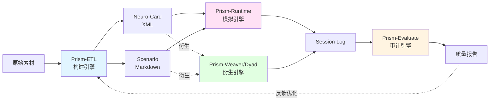

# Neural Narratology (神经叙事学)

> **从逆向工程到自动化铸造：大型语言模型(LLM)交互式叙事与角色工程学研究**
> *From Reverse Engineering to Automated Foundry: A Study on LLM Interactive Narrative and Character Engineering*

[](https://github.com/3aKHP)
[](http://www.hit.edu.cn/)
[]()
[](./LICENSE)

---

## 📖 项目简介 (Introduction)

**Neural Narratology** 是一个针对大型语言模型（LLM）在交互式角色扮演（Role-Playing）领域应用的全栈研究计划。

本项目始于对商业 LLM-RP 平台的黑箱逆向分析，终于一套基于 IDE 原生环境的自动化角色铸造流水线。我们致力于回答并解决以下核心问题：
1.  **机制解构**：商业平台如何在有限上下文窗口下实现"人设不朽"？
2.  **理论构建**：如何定义一套标准化的协议，使 AI 角色具备深度逻辑与叙事动力学？
3.  **工程实践**：如何将角色创作从手工作坊式的 Prompt 编写，转化为工业化的 **Agentic Workflow**？

## 🗺️ 研究路线图 (Roadmap)

本研究共分为三个递进阶段，分别对应了从"破解"到"构建"再到"自动化"的技术演进：

### [🌒 Phase I: Echo (回响)](./01_Echo/)
> **"Listen to the Ghost in the Machine."**

*   **核心任务**：商业平台黑箱逆向工程。
*   **关键成果**：
    *   揭示了 **"Single World-Simulator"** (单一世界模拟器) 架构。
    *   解构了 **Dynamic Persona Injection** (动态人设注入) 与轻量级 RAG 机制。
    *   提取了高级用户的"三层指令系统" (Jailbreak/Constitution/Knowledge)。
*   **📄 [阅读研究报告](./01_Echo/"回响"项目研究报告-Repo-Git.pdf)**

### [🌓 Phase II: Resonance (共鸣)](./02_Resonance/)
> **"Construct the Soul with Logic."**

*   **核心任务**：标准化 AI 角色创作路径。
*   **关键成果**：
    *   提出了 **ETL-XML-Axiom** 三位一体架构。
    *   发布了 **Protocol v5.0 (Legacy)**：综合性价比最高的剧本优先协议。
    *   发布了 **Protocol v6.0 (Omni-Foundry)**：引入动态状态机、逻辑门与 L-System 叙事分级的下一代协议。
    *   发布了 **Protocol v7.0 (Neuro-Weave)**：基于 Bio-XML 理念和认知公理的神经编织引擎，实现从"结构化数据容器"到"活体认知系统"的范式转变。
*   **📄 [阅读研究报告](./02_Resonance/"共鸣"项目研究报告-Repo-Git.pdf)**

### [🌔 Phase III: Modulation (调制)](./03_Modulation/)
> **"Control the Signal via Agents."**

*   **核心任务**：基于 IDE 原生环境的智能体辅助生产 (VibeCoding)。
*   **关键成果**：
    *   **Prism Engine 矩阵架构**：从初期的三位一体，扩展为包含 ETL（构建）、Runtime（模拟）、Evaluate（审计）、Weaver（衍生小说）和 Dyad（衍生数据）的五大引擎生态。
    *   基于 VSCode + RooCode 的自动化角色铸造流水线。
    *   实现了 **Zero-Copy** 工作流：利用智能体操作文件系统，实现从自然语言意图到结构化 XML/Markdown 的无缝转换。
    *   突破长上下文窗口限制的 **Chunked Writing Loop**（分块写入循环）技术。
    *   完整实现 v7.0 Neuro-Weave 理论框架。
*   **🛠️ [获取工具链](./03_Modulation/)**

---

## 📂 目录结构 (Directory Structure)

```text
Neural-Narratology/
├── 01_Echo/                        # Phase I: 逆向分析报告与脱敏数据样本
│   ├── backend_request_structure.yaml
│   ├── preset_meta_commands.txt
│   ├── RAG_inject.xml
│   └── "回响"项目研究报告-Repo-Git.pdf
│
├── 02_Resonance/                   # Phase II: 核心协议与理论框架
│   ├── v5_Legacy/                  # 社区标准版协议（剧本优先）
│   ├── v6_Omni_Foundry/            # 全息灵魂协议（动态状态机）
│   ├── v7_Neuro_Weave/             # 神经编织引擎（认知模拟）⭐ 最新
│   └── "共鸣"项目研究报告-Repo-Git.pdf
│
├── 03_Modulation/                  # Phase III: 自动化工具链
│   ├── Prism-ETL-Universe-V7.0/    # 通用版本（推荐）⭐
│   ├── Prism-ETL-Claude/           # Claude 优化版本
│   ├── Prism-ETL-Deepseek/         # Deepseek 优化版本
│   ├── Prism-ETL-Gemini/           # Gemini 优化版本
│   ├── prism-etl_preset.yaml       # ETL 引擎配置
│   ├── prism-runtime_preset.yaml   # Runtime 引擎配置
│   ├── prism-evaluate_preset.yaml  # Evaluate 引擎配置
│   └── "调制"项目研究报告-Draft.md
│
└── README.md                       # 项目总览
```

## 🎯 核心特性 (Core Features)

### Phase II: 理论框架

| 版本 | 代号 | 核心理念 | 适用场景 |
|:---|:---|:---|:---|
| **v5.0** | Legacy | 剧本优先 | 快速创作、社区分享 |
| **v6.0** | Omni-Foundry | 全息灵魂 | 深度博弈、技术原型 |
| **v7.0** | Neuro-Weave | 认知模拟 | 心理真实感、可攻略性 ⭐ |

### Phase III: 工程实现



**五大引擎矩阵**：
- **ETL Engine**: 从原始素材逆向重构为角色 XML 和场景 MD。
- **Runtime Engine**: 执行基于文件的双向交互循环。
- **Evaluate Engine**: 提供日志质量审计与除虫指南。
- **Weaver Engine**: 突破上下文限制，将设定自动扩写为连载长篇小说。
- **Dyad Engine**: 分饰两角，全自动演绎并生成高质量的大规模交互数据集。

## 🚀 快速开始 (Quick Start)

### 方案 A：使用自动化工具链（推荐）

如果您是 **角色创作者** 或 **Prompt 工程师**，推荐从 **Phase III** 开始体验：

1.  **克隆仓库**：
    ```bash
    git clone https://github.com/3aKHP/Neural-Narratology.git
    cd Neural-Narratology
    ```

2.  **配置环境**：
    - 安装 [VSCode](https://code.visualstudio.com/)
    - 安装 [RooCode Extension](https://marketplace.visualstudio.com/items?itemName=RooVeterinaryInc.roo-cline)
    - 准备 LLM API-Key

3.  **加载工具链**：
    - 打开 [`03_Modulation/Prism-ETL-Universe-V7.0/`](./03_Modulation/Prism-ETL-Universe-V7.0/) 作为工作区
    - 在 RooCode 设置中加载三个配置文件：
      - [`prism-etl_preset.yaml`](./03_Modulation/prism-etl_preset.yaml)
      - [`prism-runtime_preset.yaml`](./03_Modulation/prism-runtime_preset.yaml)
      - [`prism-evaluate_preset.yaml`](./03_Modulation/prism-evaluate_preset.yaml)

4.  **开始创作**：
    - 切换到 `Prism ETL Engine` 模式
    - 输入：`Initialize Workflow A for [Character Name]`
    - 详细步骤参见 [Phase III README](./03_Modulation/README.md)

### 方案 B：手动使用协议

如果您希望深入理解理论或进行自定义开发：

1.  **选择协议版本**：
    - 新手推荐：[v5.0 Legacy](./02_Resonance/v5_Legacy/)
    - 深度博弈：[v6.0 Omni-Foundry](./02_Resonance/v6_Omni_Foundry/)
    - 心理真实感：[v7.0 Neuro-Weave](./02_Resonance/v7_Neuro_Weave/) ⭐

2.  **阅读协议文档**：
    - 每个版本目录下都有完整的 README 和 Step-by-Step 指南

3.  **手动执行工作流**：
    - 按照 Kernel → Driver → Stdlib 的顺序加载提示词
    - 逐步生成 Module A（角色）和 Module B（场景）

## 📚 学习路径 (Learning Path)

### 🎓 初学者路径
1. 阅读 [Phase I 研究报告](./01_Echo/"回响"项目研究报告-Repo-Git.pdf) 了解背景
2. 使用 [Phase III 工具链](./03_Modulation/) 快速上手
3. 体验 [v5.0 Legacy](./02_Resonance/v5_Legacy/) 理解基础概念

### 🔬 研究者路径
1. 深入研究 [Phase II 报告](./02_Resonance/"共鸣"项目研究报告-Repo-Git.pdf)
2. 对比 [v5.0](./02_Resonance/v5_Legacy/) / [v6.0](./02_Resonance/v6_Omni_Foundry/) / [v7.0](./02_Resonance/v7_Neuro_Weave/) 的设计差异
3. 分析 [Phase III 源码](./03_Modulation/Prism-ETL-Universe-V7.0/.roo/) 的工程实现

### 🛠️ 开发者路径
1. Fork 本仓库
2. 基于 [v7.0 Schema](./03_Modulation/Prism-ETL-Universe-V7.0/specs/) 自定义扩展
3. 修改 [System Prompts](./03_Modulation/Prism-ETL-Universe-V7.0/.roo/) 适配特定模型

## 🔬 技术亮点 (Technical Highlights)

### Bio-XML 协议
- XML 标签作为"功能器官"而非文本容器
- 强制"过程导向"描述（如何运作 vs. 是什么）
- 参考：[`Step1B - MainStdlib.md`](./02_Resonance/v7_Neuro_Weave/Step1B%20-%20MainStdlib.md)

### 三大认知公理
1. **感知滤镜**：定义角色如何过滤现实
2. **情感液压**：定义压力点和释放阀
3. **攻略性**：确保角色具有连接路径

### L-System 本能协议
- L1-L2（社交/浪漫）：情感共鸣、张力构建
- L3-L4（亲密/癖好）：感官沉浸、欲望释放
- L5（极端）：边界探索（需谨慎使用）

### Agentic Workflow
- 基于 RooCode 的文件系统操作 (Zero-Copy)
- STOP & WAIT 机制确保人机协同
- 五大引擎闭环（构建 → 模拟/衍生 → 审计）

## 📊 项目统计 (Statistics)

- **协议版本**: 3 个主要版本（v5.0, v6.0, v7.0）
- **工具链**: 4 个模型优化版本 + 1 个通用版本
- **文档**: 2 份完整研究报告 + 多份技术文档
- **代码**: 6 个 Step 文件 + 3 个引擎系统提示词
- **Schema**: 2 个标准化规范（Character + Scenario）

## ⚠️ 免责声明 (Disclaimer)

*   本项目涉及的逆向工程内容仅供学术研究与安全防御教学使用。
*   项目中提到的特定商业平台（代号 Platform-X / FurryBar）仅作为案例分析对象，不代表对其商业模式的评价。
*   所有敏感数据与个人信息均已进行脱敏处理。
*   L-System 中的高级别内容（L4-L5）涉及成人主题，使用者需自行承担法律责任并遵守当地法规。

## 🤝 致谢 (Acknowledgements)

感谢哈尔滨工业大学计算学部的学术环境支持。  
感谢开源社区对 v5.0 协议的反馈与迭代。  
感谢 RooCode 团队提供的强大 IDE 集成能力。

## 📮 联系方式 (Contact)

- **GitHub**: [@3aKHP](https://github.com/3aKHP)
- **Issues**: [提交问题或建议](https://github.com/3aKHP/Neural-Narratology/issues)

## 📄 许可证 (License)

本项目采用 [MIT License](./LICENSE) 开源协议。

---
*Copyright © 2025 3aKHP. All rights reserved.*
